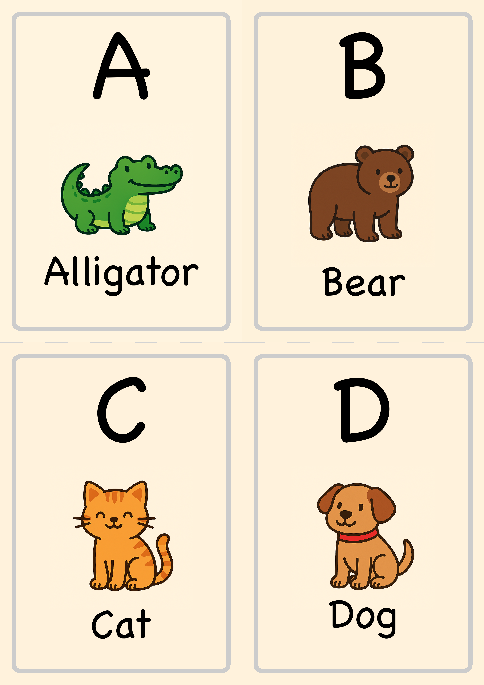
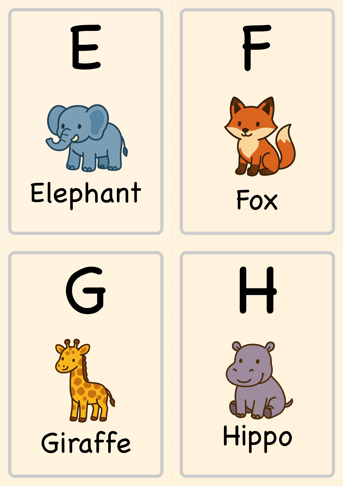
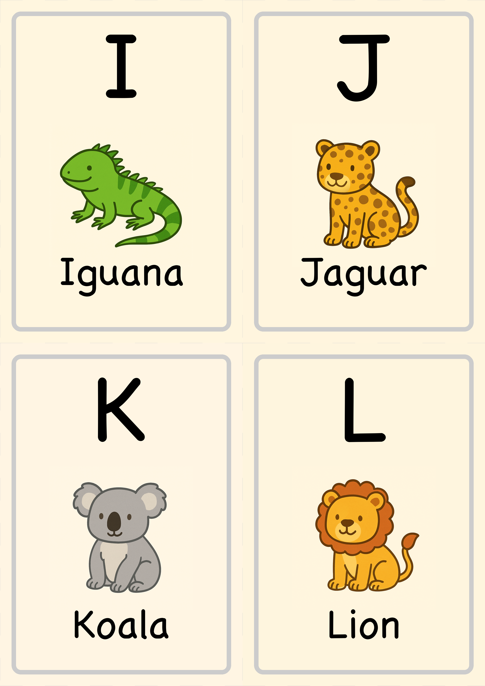
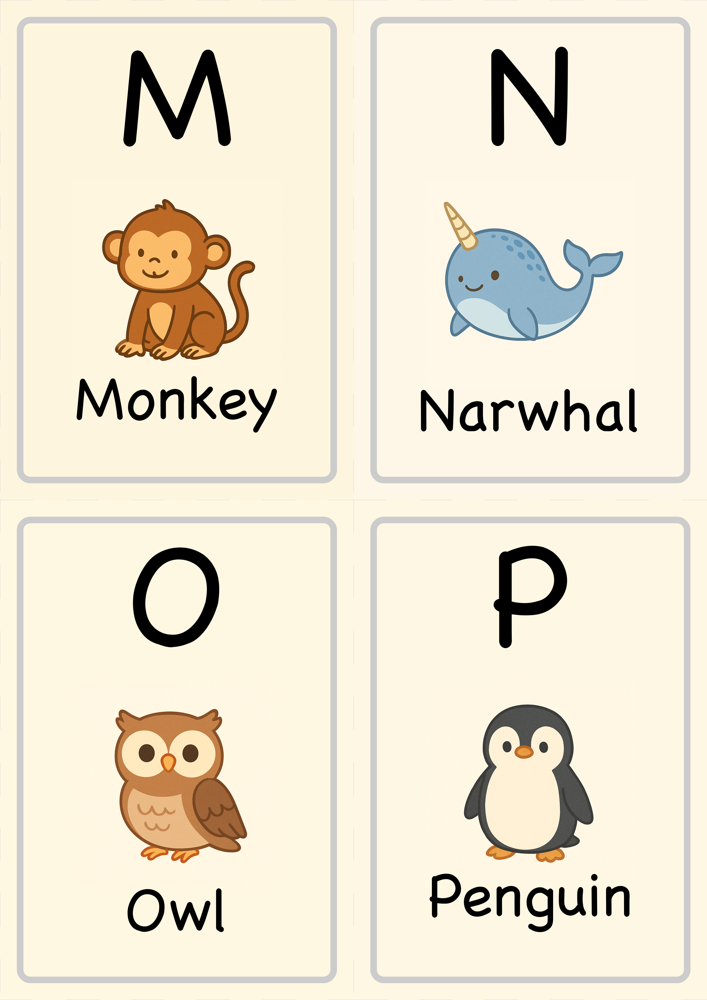
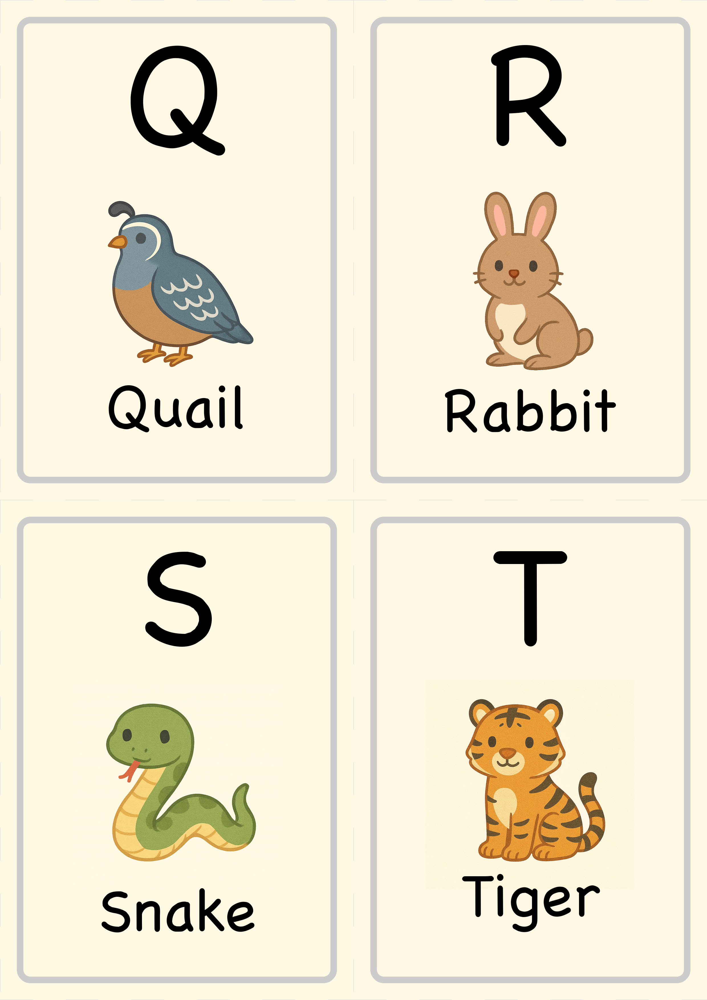
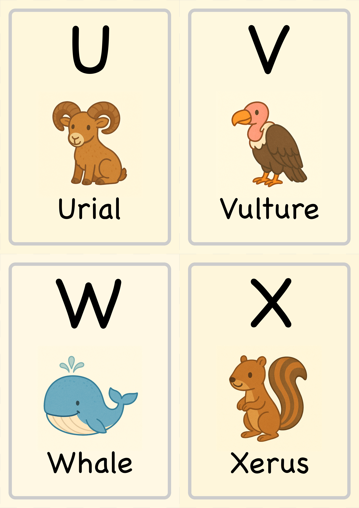
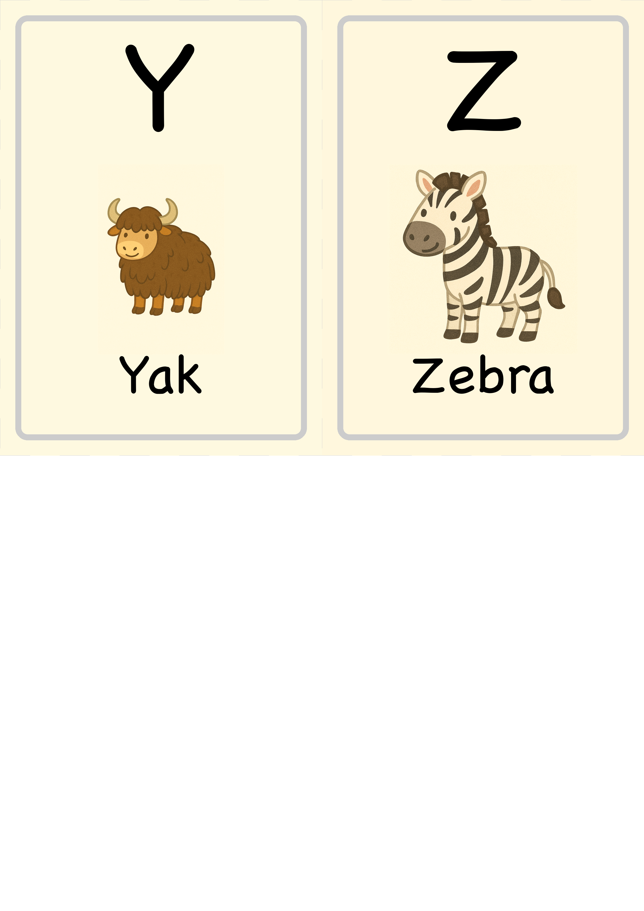

# 🦁 Animal Alphabet Flashcards Generator

A Python script that generates beautiful, printable A4 sheets containing four A6 toddler flashcards per page. Each card features a large uppercase letter, a centered animal illustration, and the animal's name using the delightful Chalkboard SE font.

## ✨ Features

- **True A4 output** (210mm × 297mm) at 300 DPI for high-quality printing
- **Automatic page breaks** – 4 cards per sheet in A-D, E-H… order
- **Rounded corner borders** with grey dashed cut lines for easy separation
- **Dynamic background colors** extracted from image edges for visual harmony
- **Perfect text alignment** with proper centering and spacing
- **Flexible image support** – PNG, JPG, and SVG (rasterized) formats
- **Customizable fonts, colors, DPI, and margins**
- **CSV mapping support** for custom animal names and image paths

## 🎨 Sample Output

The generator creates beautiful flashcards like these:

```
┌─────────────┐  ┌─────────────┐
│      A      │  │      B      │
│             │  │             │
│   🐊        │  │   🐻        │
│             │  │             │
│  Alligator  │  │    Bear     │
└─────────────┘  └─────────────┘
```

Each sheet contains 4 cards with:
- Large, clear uppercase letters
- Cute animal illustrations
- Easy-to-read animal names
- Color-coordinated backgrounds

## 🚀 Quick Start

### Prerequisites

- Python 3.8+
- Pillow (PIL) library

### Installation

1. **Clone or download this repository**
2. **Create a virtual environment** (recommended):
   ```bash
   python3 -m venv .venv
   source .venv/bin/activate  # On Windows: .venv\Scripts\activate
   ```
3. **Install dependencies**:
   ```bash
   pip install Pillow
   ```

### Basic Usage

1. **Place your animal images** in the `animals/` folder:
   - Name them `A.png`, `B.png`, `C.png`... `Z.png`
   - Use any common image format (PNG, JPG, SVG)

2. **Run the generator**:
   ```bash
   python flashcard_generator.py --images animals/ --outdir sheets/
   ```

3. **Find your flashcards** in the `sheets/` folder:
   - `flashcards_A-D.png` 
   - `flashcards_E-H.png` 
   - `flashcards_I-L.png` 
   - `flashcards_M-P.png` 
   - `flashcards_Q-T.png` 
   - `flashcards_U-X.png` 
   - `flashcards_Y-Z.png` 


### Font Customization

Use different fonts by specifying the path:

**macOS:**
```bash
# Chalkboard SE (playful, child-friendly)
--font /System/Library/Fonts/Supplemental/ChalkboardSE.ttc

# Helvetica (clean, modern)
--font /System/Library/Fonts/Helvetica.ttc
```

## 🎨 Default Animals

The generator includes these default animal names:

| Letter | Animal | Letter | Animal | Letter | Animal | Letter | Animal |
|--------|--------|--------|--------|--------|--------|--------|--------|
| A | Alligator | G | Giraffe | M | Monkey | S | Snake |
| B | Bear | H | Hippo | N | Narwhal | T | Tiger |
| C | Cat | I | Iguana | O | Owl | U | Urial |
| D | Dog | J | Jaguar | P | Penguin | V | Vulture |
| E | Elephant | K | Koala | Q | Quail | W | Whale |
| F | Fox | L | Lion | R | Rabbit | X | Xerus |
| | | | | | | Y | Yak |
| | | | | | | Z | Zebra |

## 🖨️ Printing Guidelines

- **Paper**: Standard A4 (210mm × 297mm)
- **Resolution**: 300 DPI for crisp, professional quality
- **Colors**: Full color recommended
- **Cutting**: Follow the grey dashed lines to separate cards
- **Card size**: Each flashcard is A6 size (105mm × 148mm)

## 🤝 Contributing

Feel free to fork this project and submit pull requests for improvements!

## 📄 License

This project is open source. Feel free to use and modify as needed.

---

*Made with ❤️ for early childhood education* 